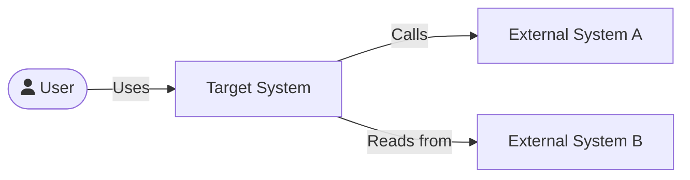

# Architect Skill — Enterprise Architecture Documents

## Overview

This skill produces architecture artifacts and orchestrates a suite of specialized sub-skills.
Read this file fully before beginning any output.

**Always clarify mode if ambiguous.** If the user provides a requirement but doesn't specify
Quick Read, Solution Intent, or Review, ask which they want — or if in a hurry, default to
Quick Read first and offer to expand.

For **Architecture Impact** analysis (how a proposed change affects existing applications),
route to the `architecture-impact` skill.

---

## Mode 1: Quick Read

### Purpose
A 1–2 page executive brief suitable for leadership, stakeholders, or pre-meeting context-setting.
Fast to read, decision-oriented, no deep technical weeds.

### Output
- **Markdown (.md)** — formatted for Confluence upload via the Confluence Markdown macro or direct paste
- Name file: `[initiative-name]-quick-read.md`

### Confluence Markdown Notes
- Use `#` for H1 title, `##` for section headings
- Use standard `-` bullet lists (Confluence renders these correctly)
- Use `**bold**` for emphasis within paragraphs
- Use `---` horizontal rules between major sections
- Avoid HTML tags — Confluence Markdown macro doesn't support them
- Tables use standard Markdown pipe syntax (`| col | col |`)

### Sections (in order)
```
# [Initiative Name] — Quick Read
**Date:** [date] | **Author:** [name or "Architecture Team"] | **Classification:** Internal

---

## Problem Statement
[2–4 sentences. What pain or opportunity is being addressed?]

## Proposed Approach
[3–5 sentences. High-level solution direction.]

## Key Capabilities
- [Capability 1]
- [Capability 2]

## Dependencies & Risks
**Dependencies**
- [item]

**Risks**
- [item]

## Next Steps
| Action | Owner | Target |
|--------|-------|--------|
| [action] | [owner] | [date] |
```

### Tone
Plain language. No jargon. A VP who doesn't code should understand every sentence.

---

## Mode 2: Solution Intent

### Purpose
A comprehensive architecture document that captures the full picture — current state, proposed
solution, component breakdown, architecture decisions, risks, and roadmap. This is the primary
deliverable architects produce for project approval, CTO review, or handoff to engineering teams.

### Output
- **Markdown (.md)** — formatted for Confluence or direct sharing
- Name file: `[initiative-name]-solution-intent.md`

### Sections

**REQUIRED sections — always include these four:**

#### 1. Problem Statement & Goals *(REQUIRED)*
- **Problem**: What is broken, slow, costly, or missing?
- **Goals**: 3–5 measurable objectives (use SMART framing where possible)
- **Non-goals**: What is explicitly out of scope?
- **Success Criteria**: How will we know this worked?

#### 2. Proposed Solution & Architecture Diagrams *(REQUIRED)*
- Describe the to-be state at a conceptual level
- Explain architectural approach and key design decisions
- Include at least one **Mermaid diagram** (see Diagram section below)
- If current state is known, include an As-Is diagram for contrast

#### 3. Component Breakdown & Responsibilities *(REQUIRED)*
A table with columns: **Component | Responsibility | Technology | Owner/Team**
Add a brief paragraph after the table explaining how components interact.

#### 4. Risks, Assumptions & Dependencies *(REQUIRED)*
Three sub-sections:

**Risks**: Risk | Likelihood (H/M/L) | Impact (H/M/L) | Mitigation
**Assumptions**: Numbered list of assumptions the solution depends on
**Dependencies**: External systems, teams, or decisions required

---

**OPTIONAL sections — include when context warrants or user requests:**

#### Cover Page *(optional — include for formal submissions)*
- Initiative name, version (start v0.1 draft), date, author, classification, status

#### Table of Contents *(optional — include for docs > 5 sections)*

#### Executive Summary *(optional)*
3–5 sentences: problem, solution, key benefits, ask.

#### Current State / As-Is Architecture *(optional — include if replacing an existing system)*
Narrative description + Mermaid diagram of the existing landscape.

#### Architecture Decision Records *(optional — include for significant technical decisions)*
Mini-ADR format per decision:
- **Decision**: [title] | **Status**: Proposed / Accepted
- **Context**: Why this decision was needed
- **Choice**: What was decided
- **Consequences**: Trade-offs and impacts

Include 2–4 ADRs for substantive solutions.

#### Roadmap & Milestones *(optional — include if timeline/phasing is known)*
Phased delivery: Phase 1 Foundation, Phase 2 Core, Phase 3 Scale.
For each: timeframe, deliverables, success criteria.

#### Open Questions *(optional)*
Numbered list of unresolved questions.

#### Appendix *(optional)*
Supporting data, additional diagrams, reference links.

---

**When in doubt:** Default to the 4 required sections. Ask the user if they want any optional sections added.

---

## Mode 3: Architecture Review

### Purpose
Structured critique of a proposed or existing architecture. Provides honest, constructive
feedback with specific gaps, risks, and actionable recommendations.

### Output
- **Markdown (.md)** — formatted for Confluence or direct sharing
- Name file: `[initiative-name]-architecture-review.md`

### Sections (in order)
1. **Review Summary** — 3–5 sentences: overall assessment, major strengths, primary concern
2. **What Works Well** — Bullet list of genuine strengths (be specific, not generic)
3. **Gaps & Missing Elements** — What's absent that should be there?
4. **Risks Identified** — Specific technical, operational, or organizational risks
5. **Assumptions Being Made** — Implicit assumptions that should be stated explicitly
6. **Alternative Approaches to Consider** — 2–3 alternatives with brief trade-off notes
7. **Recommendations** — Prioritized action items (High / Medium / Low priority)
8. **Questions for the Architect** — 3–5 clarifying questions

### Tone
Collegial, direct, constructive. Not a red pen — a peer review. Assume the architect is
competent and made reasonable choices; focus on what's missing or could be stronger.

---

## Diagrams

Include Mermaid diagrams as fenced code blocks (` ```mermaid `). They render natively in
Confluence, GitHub, and most Markdown viewers — no rendering step needed.

### When to include diagrams
- Quick Read: Only if the solution has a clear flow worth showing (1 diagram max)
- Solution Intent: Current state + proposed state (2 diagrams minimum)
- Review: Only if illustrating a gap or alternative

### Common diagram types
Use `flowchart LR` for system context and component diagrams.
Use `sequenceDiagram` for API/integration flows.
Use `graph TD` for hierarchical component views.

**Example C4-style context diagram:**
````

````

---

## Output Location

Save files to the current working directory unless the user specifies otherwise.
Name files descriptively: `[initiative-name]-quick-read.md`, `[initiative-name]-solution-intent.md`, etc.

---

## Research Phase

Before writing any Solution Intent, the architect skill **automatically spawns the
`research` subagent** (see `agents/research.md`) to discover what already exists. This is
not optional — designing without knowing what's available leads to redundant builds and
missed integration opportunities.

### Auto-trigger on Solution Intent
When a Solution Intent is requested, before generating any sections:
1. Spawn the `research` agent with the initiative name, problem, and capability keywords
2. The agent searches Confluence, API Marketplace, Application Registry, and web
3. The Research Brief is saved as a standalone `.md` file and presented to the user
4. Use findings to inform the Solution Intent — reference discovered systems in Current State,
   Dependencies, Risks, and Open Questions sections, but do not auto-insert the brief verbatim

### Research context brief (sent to research agent)
```
Initiative: [name]
Problem: [summary]
Proposed Approach: [direction]
Capability Keywords: [extracted from requirement — e.g. "customer identity, account lookup, KYC"]
Domains: [extracted domains — e.g. "identity, accounts"]
Output Mode: orchestrated
```

---

## Sub-Skill Orchestration

The architect skill orchestrates a set of grouped **subagents** (defined in `agents/`),
each covering a cluster of related concerns. Subagents are spawned with a context brief
and return section bodies ready to slot into the document. Each subagent reads the
relevant skill files and references internally — you do not need to read them yourself.

Individual skills (in `.claude/skills/`) can still be invoked standalone by the user.

### Subagent Delegation

| Agent (file in `agents/`) | Covers | When to spawn |
|---------------------------|--------|---------------|
| `research.md` | Existing systems, APIs, owners, capabilities | Always first for Solution Intent |
| `domain.md` | DDD, bounded contexts, impact assessment, C1/C2 diagrams | Always |
| `service-design.md` | Microservice decomposition, tech stack | Always |
| `integration.md` | API design, external REST, Kafka events, UX/MFE | When APIs, events, or UI are involved |
| `data.md` | Database selection, data architecture, migration | When data is owned or moved |
| `infrastructure.md` | Deployment patterns, network design, C4/Workload | Always |
| `security.md` | Identity, encryption, API/Kafka/DB security, compliance | Always |
| `operations.md` | Observability, resiliency, performance, cost | Always |
| `diagrams.md` | C3 component diagrams, sequence diagrams | Always (after design agents complete) |
| `reviewer.md` | Peer review, findings block, annotated doc | Always last (review-fix loop) |

Spawn all applicable agents. Always spawn `domain`, `service-design`, `infrastructure`,
`security`, `operations`, `diagrams`, and `reviewer` — these run on every Solution Intent.

### Context Brief (pass this to each agent)

Tailor the brief per agent. Include outputs from upstream agents where required:

```
Initiative: [name]
Problem: [2–3 sentence summary]
Proposed Approach: [high-level solution direction]
Research Brief: [path to research brief]
[Agent-specific inputs — see each agent's Inputs section in agents/]
Output Mode: orchestrated
```

### Assembly order for Solution Intent
1. Document header (title, metadata, classification)
2. Problem Statement & Goals *(architect writes)*
3. → Spawn `research` agent — wait for Research Brief before proceeding
4. → Spawn `domain` agent — produces: Architecture Impact, Domain Design, C1/C2 diagrams
5. Proposed Solution Overview *(architect writes, informed by domain agent output)*
6. Architecture Diagrams — C1/C2 *(from domain agent — insert here)*
7. → Spawn `service-design` agent — produces: Service Decomposition, Tech Stack
8. → Spawn `integration`, `data`, `infrastructure` agents in parallel (feed service-design outputs to each)
9. → Spawn `security` agent — requires: integration + data + infrastructure outputs
10. → Spawn `operations` agent — requires: infrastructure + security outputs
11. → Spawn `diagrams` agent — requires: all design agent outputs — produces: C3, Sequence
12. Architecture Diagrams — C3 + Sequence *(from diagrams agent — insert here)*
13. Domain Design *(from domain agent)*
14. Service Decomposition + Tech Stack *(from service-design agent)*
15. API Design + Event Design + UX Integration *(from integration agent)*
16. Database Design + Data Architecture *(from data agent)*
17. Deployment & Infrastructure *(from infrastructure agent)*
18. Security Architecture *(from security agent)*
19. Production Operations *(from operations agent)*
20. Component Breakdown & Responsibilities *(architect writes, informed by agent outputs)*
21. Risks, Assumptions & Dependencies *(architect writes, aggregating all ⚠️ flags)*
22. Optional sections (ADRs, Roadmap, Open Questions)
23. **→ Enter review-fix loop** (see below)

**Aggregate enterprise deviation flags** — collect all ⚠️ callouts from sub-skills into a
"Pattern Deviations Summary" at the top of the Risks section if any exist.

### Review-Fix Loop

After assembling the document, run this loop automatically — no user interaction needed.

```
pass = 1
loop (max 2 passes):
    send document + pass number → architecture-reviewer (orchestrated mode)
    receive REVIEW_FINDINGS block

    if clean == true:
        exit loop → proceed to delivery

    apply all findings marked critical and important:
        for each finding:
            locate the section named in finding.location
            apply the exact fix instruction in finding.fix
            log the change: "F001 fixed: [what was done]"

    pass += 1

→ proceed to delivery (regardless of remaining issues after 2 passes)
```

### Applying Fixes

When applying findings from the reviewer:
- Apply **critical** fixes always
- Apply **important** fixes always
- Apply **minor** fixes if straightforward; skip if they require information you don't have
- Never invent content to fill a gap — if a fix requires information only the user has
  (e.g. a specific team name, a budget figure), flag it as an open question in the document
- Log every change made (used to build the annotated output)

### Delivery

After the loop completes (clean or 2-pass limit reached):

1. Save the final corrected document as `[initiative-name]-[doc-type].md`
2. Run one final pass of `architecture-reviewer` in **standalone mode** to produce the
   annotated version — `[initiative-name]-[doc-type]-annotated.md`
   - This annotated version reflects the final state: fixes applied, remaining issues flagged
   - Any unresolved critical or important issues appear as 🔴/🟡 callouts in the annotated doc
3. Present both files with `present_files`
4. Briefly state: passes run, issues fixed, and count of anything remaining

### Remaining Issues

If any critical or important issues remain after 2 passes, do NOT block delivery.
They will be visible as inline callouts in the annotated document.
Briefly note them in your summary: *"2 findings could not be auto-resolved and are
flagged in the annotated version for your review."*

---

## Workflow — Step by Step

### For every request:

1. **Identify the mode** (Quick Read / Solution Intent / Review). Ask if unclear.

2. **Extract key information** from the user's requirement or description:
   - Initiative / project name
   - Problem being solved
   - Proposed approach (if known)
   - Constraints, stakeholders, timeline (if mentioned)

3. **Ask clarifying questions** if critical information is missing:
   - What is the initiative name?
   - Is there an existing system being replaced or modified?
   - Who is the primary audience? (leadership, engineering, product)
   - What is the target timeline?
   - Should author be a specific name or "Architecture Team"?

4. **For Solution Intent:**
   a. Spawn `research` agent first — extract capability keywords and domains,
      send context brief, wait for Research Brief before proceeding.
   b. Spawn `domain` agent — pass research brief; wait for outputs (domain events, service
      candidates, impact list) before spawning downstream agents.
   c. Spawn `service-design` agent — pass domain outputs; wait for service list and tech stack.
   d. Spawn `integration`, `data`, and `infrastructure` agents in parallel — pass service-design
      outputs to each.
   e. Spawn `security` and `operations` agents once integration/data/infrastructure are done.
   f. Spawn `diagrams` agent once all design agents have completed.
   g. Assemble all outputs in the order defined in the assembly order above.

5. **For Quick Read:** Generate directly — no subagent delegation needed.

6. **C1/C2 diagrams** come from the `domain` agent. **C3 and sequence diagrams** come from
   the `diagrams` agent. **C4/Workload** comes from the `infrastructure` agent.

7. **Run review-fix loop** (up to 2 passes), then final annotated pass for delivery.

8. **Present both files** — final doc + annotated version — using `present_files`.

9. **Briefly summarize:** passes run, issues fixed, anything flagged in the annotated doc.

---

## Quality Checklist

Before presenting output, verify:

**Quick Read**
- [ ] Valid Markdown — no HTML tags, renders cleanly in Confluence
- [ ] Title block has date, author, classification
- [ ] Next steps table is populated with at least 3 rows
- [ ] File named `[initiative-name]-quick-read.md`
- [ ] Review-fix loop ran (up to 2 passes)

**Solution Intent**
- [ ] All 4 required sections present and substantive
- [ ] All applicable agents spawned and outputs assembled in correct order
- [ ] Enterprise deviation flags (⚠️) aggregated into Risks section
- [ ] At least one Mermaid diagram per design section included
- [ ] File named `[initiative-name]-solution-intent.md`
- [ ] Review-fix loop ran (up to 2 passes)

**Both outputs**
- [ ] Annotated version produced from final-state document
- [ ] Remaining unresolved issues visible as callouts in annotated doc
- [ ] Both files presented: `[doc].md` and `[doc]-annotated.md`

---

## Templates

If the user provides document templates, store them in `references/templates/`:
```
references/templates/
├── quick-read-template.md       ← Confluence-ready Markdown template
├── solution-intent-template.md  ← Solution intent Markdown template
└── README.md                    ← Notes on how to apply each template
```

**If templates are present:** Load the appropriate template and use it as the structural base,
overriding the defaults in this skill.

**If templates are absent:** Use the defaults defined in this SKILL.md.
