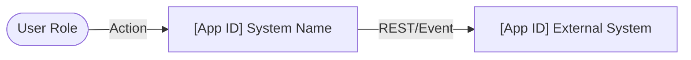
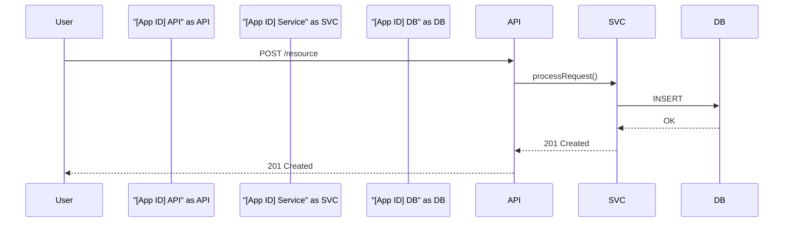

# Architecture Diagrams Skill

## Overview

This skill produces architecture diagrams following company diagramming standards. All diagrams
are rendered as Mermaid code blocks (render natively in Confluence and GitHub) or as
structured text descriptions when Mermaid cannot express the required notation.

Read `references/diagram-standards.md` for company shape, color, and notation conventions
before producing any diagram.

---

## Diagram Types

### C1 — System Context

Shows the target system in relation to its users and external systems. Highest level of
abstraction — one box for the whole system.

**When to use:** Opening diagram in any Solution Intent; exec-level communication.

**Company conventions:** See `references/diagram-standards.md` — Section: C1 Standards.

---

### C2 — Container Diagram

Shows the major deployable units (containers) inside the target system: web apps, APIs,
databases, message queues, etc.

**When to use:** Technical audience; shows what's being built and how containers communicate.

**Company conventions:** See `references/diagram-standards.md` — Section: C2 Standards.

---

### C3 — Component Diagram

Shows the internal components within a single container. Company C3 differs from the
industry-standard C4 model — see `references/diagram-standards.md` for the specific
shape and connection conventions used here.

**When to use:** Engineering handoff; detailed design of a specific service or API.

**Company conventions:** See `references/diagram-standards.md` — Section: C3 Standards.

---

### C4 / Workload Design

Company's workload design diagram. This differs from the industry-standard C4 — it focuses
on compute resources, data stores, and runtime topology within an AWS environment.

**When to use:** Infrastructure and deployment design; shows what runs where.

**Company conventions:** See `references/diagram-standards.md` — Section: C4/Workload Standards.

---

### Sequence Diagram

Shows the time-ordered interaction between systems, services, or actors for a specific flow.

**When to use:** API call chains, event flows, authentication sequences, complex workflows.

**Company conventions:** See `references/diagram-standards.md` — Section: Sequence Standards.

---

## Application ID Display

Every system, service, and application in a diagram must display its Application ID alongside
its name. Format: `[APP-ID] Application Name`. See `references/diagram-standards.md` for the
company's Application ID format and registry lookup.

---

## Process

1. Identify which diagram type(s) are needed based on the section of the document.
2. Read `references/diagram-standards.md` for the relevant section's conventions.
3. Produce the diagram as a Mermaid code block.
4. If Mermaid cannot express a required element (e.g., company-specific shape), produce a
   structured text description and note it as "pending visual render."
5. Flag any unknown Application IDs as open questions for the architect.

---

## Reference Files

- `references/diagram-standards.md` — Company diagramming standards: shapes, colors,
  connection types, Application ID format, and conventions per diagram type.
  **TODO:** Populate with your organization's standards for C1/C2/C3/C4/sequence diagrams.
