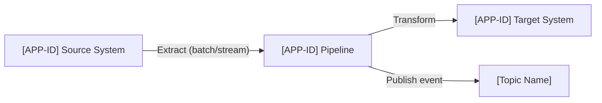

# Data Architecture Skill

## Overview

This skill designs data architecture covering: data flow and movement, caching strategy,
analytical platform integration, data publishing patterns, and data migration. All patterns
must align to company data standards.

Read `references/data-standards.md` for company-approved data patterns, platform integrations,
and publishing contracts before producing any data architecture.

---

## Output

- **Markdown (.md)** — Data Architecture section for Solution Intent, or standalone analysis
- Name file: `[initiative-name]-data-architecture.md`

---

## Sections

### Data Flow & Movement

Map data flows between systems:



For each data flow, document:
- Source system and format
- Trigger: batch schedule, event-driven, or real-time stream
- Transformation logic (high-level)
- Destination system and format
- Latency SLA

### Caching Strategy

| Data | Cache Technology | Pattern | TTL | Invalidation Strategy |
|------|-----------------|---------|-----|-----------------------|
| [Data type] | [Redis / CDN / etc.] | Cache-aside / Read-through | [TTL] | [Event / TTL expiry / manual] |

**Company cache standards** (see `references/data-standards.md`):
- Distributed cache required for any shared state — no local/in-process caches for shared data
- Explicit TTL required on all cache entries
- Cache-aside preferred; document justification for read-through/write-through
- Data lineage must be documented for all cached data that flows downstream

### Data Consumption Patterns

How do downstream consumers access this solution's data?

| Consumer | Pattern | Interface | Latency |
|----------|---------|-----------|---------|
| [System] | REST API pull / Event subscription / Direct DB read / File extract | [detail] | [SLA] |

Flag any direct database access by external consumers as ⚠️ — data APIs or events are preferred.

### Analytical Platform Integration

If data from this solution feeds an analytical or reporting platform:
- Identify the company's approved analytical platform (see `references/data-standards.md`)
- Document the publishing pattern: CDC, batch extract, event stream, or API poll
- Schema: document the data model published to the analytical platform
- Latency: near-real-time, hourly, daily?
- Data quality gates: validation before publishing

### Data Publishing Patterns

When this solution publishes data for other systems to consume:

| Dataset | Consumers | Mechanism | Schema | Frequency |
|---------|-----------|-----------|--------|-----------|
| [Data] | [Systems] | Kafka topic / REST API / File / CDC | [Schema ref] | [Frequency] |

### Data Migration

If this solution replaces or modifies an existing data store:
- Migration approach: big-bang, phased, parallel-run
- Rollback strategy if migration fails
- Data validation: how will migrated data be verified?
- Cutover plan: sequence of steps and go/no-go criteria
- Reference `references/data-standards.md` — Data Migration Patterns

---

## Document Structure

```
# [Initiative Name] — Data Architecture

## Data Flow Overview
[Mermaid flow diagram]

## Caching Strategy
[Table + TTL and invalidation detail]

## Data Consumption Patterns
[Table: consumer | pattern | interface | latency]

## Analytical Platform Integration
[Publishing pattern, schema, latency]

## Data Publishing
[Table: dataset | consumers | mechanism | schema | frequency]

## Data Migration
[Approach, validation, rollback, cutover]

## Open Questions
```

---

## Reference Files

- `references/data-standards.md` — Company data consumption patterns, approved caching
  technology, analytical platform and publishing standards, data migration patterns.
  **TODO:** Populate with your organization's data architecture standards.
