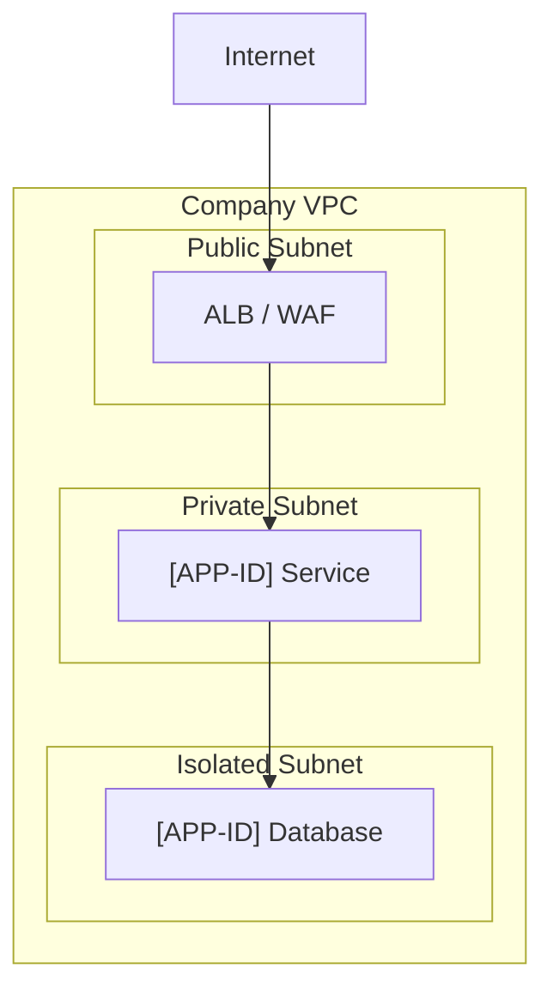

# Deployment Patterns Skill

## Overview

This skill designs deployment architecture and network topology aligned to the company's
supported deployment tooling and network standards. Not all deployment patterns are supported
— this skill enforces what the company's platform can actually deliver.

Read `references/deployment-standards.md` for approved compute types, deployment tooling,
network topology, and environment strategy before producing any design.

---

## Output

- **Markdown (.md)** — Deployment & Network section for Solution Intent, or standalone analysis
- Name file: `[initiative-name]-deployment.md`

---

## Sections

### Compute & Hosting

Based on the solution's needs, identify the appropriate compute pattern from the company's
approved options (see `references/deployment-standards.md` — Compute Patterns):

| Workload Type | Approved Compute Pattern |
|---------------|--------------------------|
| Long-running API / service | [Company standard — e.g., EKS, ECS] |
| Scheduled / batch job | [Company standard — e.g., ECS Scheduled Task, Lambda] |
| Event-triggered function | [Company standard — e.g., Lambda] |
| Static UI / MFE bundle | [Company standard — e.g., S3 + CloudFront] |
| Data pipeline | [Company standard — e.g., EMR, Glue] |

### Deployment Tooling

Document which company-approved deployment tools will be used:
- Infrastructure as Code: [approved tool from `references/deployment-standards.md`]
- CI/CD pipeline: [approved platform]
- Container registry: [approved registry]
- Secret management: [approved secrets store]
- Configuration management: [approved approach]

### Environment Strategy

| Environment | Purpose | Promotion Gate |
|-------------|---------|----------------|
| Dev | Developer integration | Automated tests |
| Test / QA | Functional & regression | QA sign-off |
| Staging / Pre-prod | Production parity | Perf test + approval |
| Production | Live | Change board approval |

Document any environment-specific configuration differences.

### Network Design

Design the network topology following company VPC and subnet conventions
(see `references/deployment-standards.md` — Network Standards):

- **VPC assignment:** Which VPC does this solution live in?
- **Subnet placement:** Public / private / isolated tier per component
- **Security groups:** Ingress/egress rules per service — principle of least privilege
- **Load balancing:** Internal ALB, external ALB, NLB — per company standard
- **DNS:** Service discovery and external DNS conventions
- **Firewall / WAF:** Required for internet-facing endpoints



### Deployment Pattern

Select the deployment strategy aligned to the solution's availability requirements:

| Pattern | When to use |
|---------|------------|
| Blue/Green | Zero-downtime deploys; easy rollback |
| Canary | Gradual traffic shift; risk reduction for large changes |
| Rolling | Standard; acceptable for stateless services |
| In-place | Only for dev/test; never production |

### Exception Handling

Flag any compute or deployment pattern not supported by company tooling as ⚠️ and
describe the exception approval path.

---

## Document Structure

```
# [Initiative Name] — Deployment & Network Design

## Compute & Hosting
[Table: component → approved compute pattern]

## Deployment Tooling
[IaC, CI/CD, registry, secrets]

## Environment Strategy
[Table: env | purpose | gate]

## Network Design
[VPC, subnets, security groups, load balancing — with Mermaid diagram]

## Deployment Pattern
[Blue/green, canary, rolling — with justification]

## Exception Requests
[Any unsupported patterns]
```

---

## Reference Files

- `references/deployment-standards.md` — Company approved compute patterns, deployment
  tooling, network topology conventions, environment strategy, and exception process.
  **TODO:** Populate with your organization's deployment and network standards.
