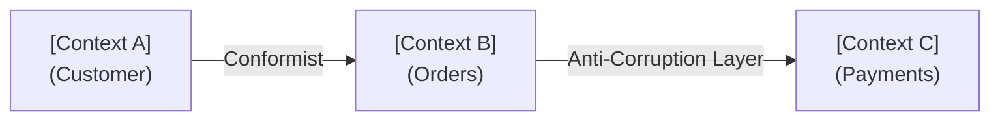

# Domain Driven Design Skill

## Overview

This skill applies DDD principles to produce a domain model that drives service decomposition,
API contract design, and event schema decisions. DDD output feeds directly into the
microservice, API, and event-driven sub-skills.

---

## Output

- **Markdown (.md)** — Domain Design section for Solution Intent, or standalone analysis
- Name file: `[initiative-name]-domain-design.md`

---

## Process

### Step 1: Identify the core domain

Extract from the requirement:
- What is the primary business capability being modeled?
- What subdomains exist (core, supporting, generic)?
- What is in scope vs. out of scope for this initiative?

### Step 2: Define bounded contexts

A bounded context is an explicit boundary within which a domain model is valid and consistent.
For each bounded context:
- Name it clearly (becomes a service candidate name)
- Define what it owns: entities, aggregates, events
- Define what it does NOT own (belongs elsewhere)
- Identify the team/squad responsible

```
Bounded Context: [Name]
Owns: [Entity1], [Entity2], [Aggregate]
Does not own: [Entity owned by another context]
Responsible team: [Team]
```

### Step 3: Define aggregates and entities

For each bounded context, identify:
- **Aggregate roots** — the transactional consistency boundary (one repository per aggregate)
- **Entities** — objects with identity that live within an aggregate
- **Value objects** — immutable descriptors with no identity (e.g., Money, Address)

### Step 4: Define the ubiquitous language

Document the shared vocabulary that the business and technical team will use within each
bounded context. Mismatched language between contexts is expected — document the translation.

### Step 5: Map context relationships



**Relationship types:**
- **Shared Kernel** — two contexts share a common model subset
- **Customer/Supplier** — upstream context serves downstream; downstream conforms or adapts
- **Conformist** — downstream adopts upstream model as-is
- **Anti-Corruption Layer (ACL)** — downstream translates upstream model to protect its own
- **Open Host Service** — upstream publishes a protocol for multiple downstreams

### Step 6: Identify domain events

For each bounded context, list the domain events it publishes and consumes:

| Event | Publisher | Consumers | Trigger |
|-------|-----------|-----------|---------|
| [EventName] | [Context] | [Context(s)] | [What causes it] |

Domain events crossing context boundaries become Kafka topics (hand off to `event-driven-design-skill`).

---

## Document Structure

```
# [Initiative Name] — Domain Design

## Subdomain Map
[Core / Supporting / Generic classification]

## Bounded Contexts
### [Context Name]
- Owns: ...
- Does not own: ...
- Team: ...

## Aggregates & Entities
[Per context table or narrative]

## Ubiquitous Language
[Glossary per context]

## Context Map
[Mermaid diagram]

## Domain Events
[Table of events, publishers, consumers]

## Service Candidates
[Recommended service boundaries derived from bounded contexts]
```

---

## Handoff to Other Skills

- **Microservice boundaries** → pass bounded context definitions to `microservice-design-skill`
- **API contracts** → pass aggregate interfaces to `api-patterns-skill`
- **Event schemas** → pass domain events to `event-driven-design-skill`
